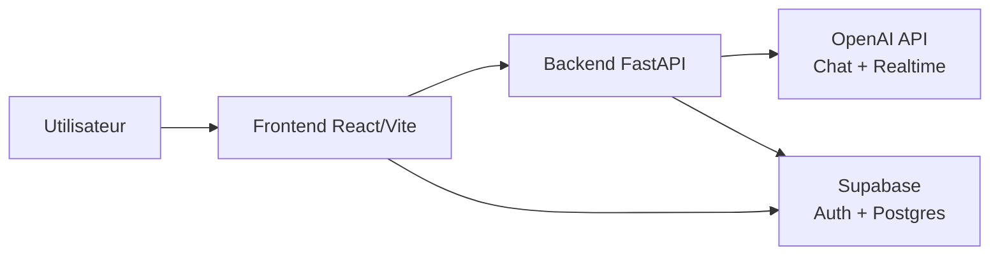

# Tutor'IA

Assistant pédagogique intelligent pour réviser en **texte**, en **vocal** et avec des **graphiques interactifs**.

Tutor'IA vise une expérience d'apprentissage plus naturelle : l'élève peut discuter avec l'IA, parler à voix haute, explorer des parcours de révision gamifiés, et visualiser des notions mathématiques en 2D/3D.

---

## Sommaire

- [Vision du projet](#vision-du-projet)
- [Ce que fait TutorIA](#ce-que-fait-tutoria)
- [Parcours utilisateur](#parcours-utilisateur)
- [Architecture technique](#architecture-technique)
- [Structure du dépôt](#structure-du-dépôt)
- [Démarrage rapide en local](#démarrage-rapide-en-local)
- [Configuration détaillée](#configuration-détaillée)
- [Déploiement](#déploiement)
- [API backend (résumé)](#api-backend-résumé)
- [Dépannage](#dépannage)
- [Roadmap](#roadmap)
- [Documentation liée](#documentation-liée)

---

## Vision du projet

Les plateformes classiques séparent souvent théorie, exercices et visualisation.  
Tutor'IA réunit ces briques dans une seule interface :

- **conversation** (texte / voix),
- **visualisation** (graphiques interactifs),
- **mémorisation** (flashcards),
- **progression** (analytics),
- **parcours gamifié** (Explorer : îles, chapitres, étapes).

Objectif : rendre les révisions plus engageantes, plus guidées et plus adaptées au niveau de l’élève.

---

## Ce que fait Tutor'IA

| Domaine | Fonctionnalités |
|---|---|
| **Tutorat IA** | Chat pédagogique avec GPT-4o, réponses explicatives adaptées au profil utilisateur |
| **Mode vocal** | Conversation temps réel avec OpenAI Realtime (WebRTC), interface orbe vocale |
| **Graphiques** | Génération et rendu de graphes JSXGraph (2D/3D) depuis le chat et la voix |
| **Gamification** | Onglet Explorer (îles, chapitres, parcours d'étapes) |
| **Révisions** | Flashcards, quiz, suivi de progression |
| **Données** | Auth, profils, conversations, messages, decks via Supabase |

---

## Parcours utilisateur

1. L’utilisateur se connecte / s’inscrit.
2. Onboarding : niveau, préférences d’apprentissage, classe (2nde/1ère/Terminale).
3. L’utilisateur choisit son mode :
   - **Chat** pour poser des questions,
   - **Voice** pour échanger oralement,
   - **Explorer** pour suivre un parcours gamifié.
4. Les échanges et la progression sont conservés (Supabase).

---

## Architecture technique



### Stack

| Couche | Technologies |
|---|---|
| **Frontend** | React 19, Vite 7, React Router, Tailwind CSS 4, Zustand, JSXGraph |
| **Backend** | Python, FastAPI, Uvicorn, OpenAI SDK |
| **Data/Auth** | Supabase (Auth + Postgres) |
| **Deploy** | Frontend sur Vercel, backend sur Render |

---

## Structure du dépôt

```text
.
├── main.py                      # Point d'entrée backend
├── render.yaml                  # Blueprint Render
├── backend/
│   ├── app.py                   # Routes API (chat, stream, realtime, health)
│   ├── config.py                # Prompts, schemas outils, instructions
│   ├── requirements.txt
│   └── ...
├── frontend/
│   ├── public/
│   ├── src/
│   │   ├── pages/               # Home, Chat, Voice, Explorer, Flashcards...
│   │   ├── components/          # UI réutilisable (GraphPanel, VoiceOrb, etc.)
│   │   ├── hooks/               # ex: useRealtimeVoice
│   │   ├── store/               # Zustand stores (auth, chat, profile...)
│   │   ├── data/                # curriculum Explorer, mock data
│   │   ├── utils/
│   │   └── lib/                 # clients externes (supabase)
│   ├── package.json
│   └── vercel.json
├── docs/                        # Guides de setup/deploy/diagnostic
├── supabase/migrations/         # Schéma base de données
├── Programmes/                  # Références programmes officiels
├── images/                      # Assets visuels source
└── maquettes/                   # Maquettes UI
```

---

## Démarrage rapide en local

### Prérequis

- Node.js 18+
- Python 3.10+
- Une clé OpenAI
- (Optionnel) Un projet Supabase

### Installation

```bash
git clone https://github.com/Romainmlt123/MVP_Tutoria.git
cd MVP_Tutoria

# Backend
python -m venv venv
source venv/bin/activate  # Windows: venv\Scripts\activate
pip install -r backend/requirements.txt

# Frontend
cd frontend
npm install
cd ..
```

### Lancer l’app

Terminal A (backend) :

```bash
python main.py
```

Terminal B (frontend) :

```bash
cd frontend
npm run dev
```

Accès :

- Frontend : `http://localhost:5173`
- Backend : `http://localhost:8000`
- Docs API : `http://localhost:8000/docs`

---

## Configuration détaillée

### Variables backend (`.env` à la racine)

```env
OPENAI_API_KEY=sk-...
HOST=0.0.0.0
PORT=8000
DEBUG=true
```

### Variables frontend (`frontend/.env`)

```env
VITE_API_URL=http://localhost:8000
VITE_SUPABASE_URL=https://xxxxx.supabase.co
VITE_SUPABASE_ANON_KEY=eyJ...
```

Notes :

- si `VITE_API_URL` est absent, fallback vers `http://localhost:8000`,
- si Supabase n’est pas configuré, certaines fonctions (auth/persistence) sont désactivées.

---

## Déploiement

| Cible | Plateforme | Guide |
|---|---|---|
| Frontend | Vercel | [docs/DEPLOY_VERCEL.md](docs/DEPLOY_VERCEL.md) |
| Backend | Render | [docs/DEPLOY_RENDER.md](docs/DEPLOY_RENDER.md) |

### Résumé

- **Vercel**
  - Root directory : `frontend`
  - Vars : `VITE_API_URL`, `VITE_SUPABASE_URL`, `VITE_SUPABASE_ANON_KEY`
- **Render**
  - Service via `render.yaml`
  - Var minimum : `OPENAI_API_KEY`

Un push sur la branche connectée déclenche le redeploy.

---

## API backend (résumé)

| Méthode | Route | Usage |
|---|---|---|
| `GET` | `/health` | Vérification santé service |
| `POST` | `/api/chat` | Réponse complète (non stream) |
| `POST` | `/api/chat/stream` | Réponse stream SSE |
| `POST` | `/api/realtime/session` | Token éphémère voice |
| `POST` | `/api/realtime/connect` | Négociation SDP WebRTC |

---

## Dépannage

### Le frontend n’atteint pas le backend

- vérifier `VITE_API_URL`,
- vérifier CORS backend,
- vérifier que le backend écoute bien sur le port attendu.

### Erreurs mode vocal

- vérifier micro/autorisations navigateur,
- vérifier la route `/api/realtime/session`,
- consulter [docs/VOICE_DIAGNOSTIC.md](docs/VOICE_DIAGNOSTIC.md).

### Erreurs de login (`Failed to fetch`)

- vérifier `VITE_SUPABASE_URL` et `VITE_SUPABASE_ANON_KEY`,
- vérifier que le projet Supabase n’est pas en pause,
- vérifier les URLs autorisées côté Supabase Auth.

---

## Roadmap

- enrichir Explorer pour toutes les matières et classes,
- générer automatiquement les parcours depuis les programmes officiels,
- renforcer l’évaluation (boss) avec scoring et progression,
- améliorer l’UX voice (transcript live, commandes vocales avancées),
- optimiser le découpage frontend (chunks > 500 kB).

---

## Documentation liée

- [docs/README.md](docs/README.md)
- [docs/DEPLOY_VERCEL.md](docs/DEPLOY_VERCEL.md)
- [docs/DEPLOY_RENDER.md](docs/DEPLOY_RENDER.md)
- [docs/SUPABASE_SETUP.md](docs/SUPABASE_SETUP.md)
- [docs/VOICE_DIAGNOSTIC.md](docs/VOICE_DIAGNOSTIC.md)
- [PATCHLOG.md](PATCHLOG.md)

---

## Licence

Projet à usage éducatif / privé.

---

Dépôt GitHub : [github.com/Romainmlt123/MVP_Tutoria](https://github.com/Romainmlt123/MVP_Tutoria)
